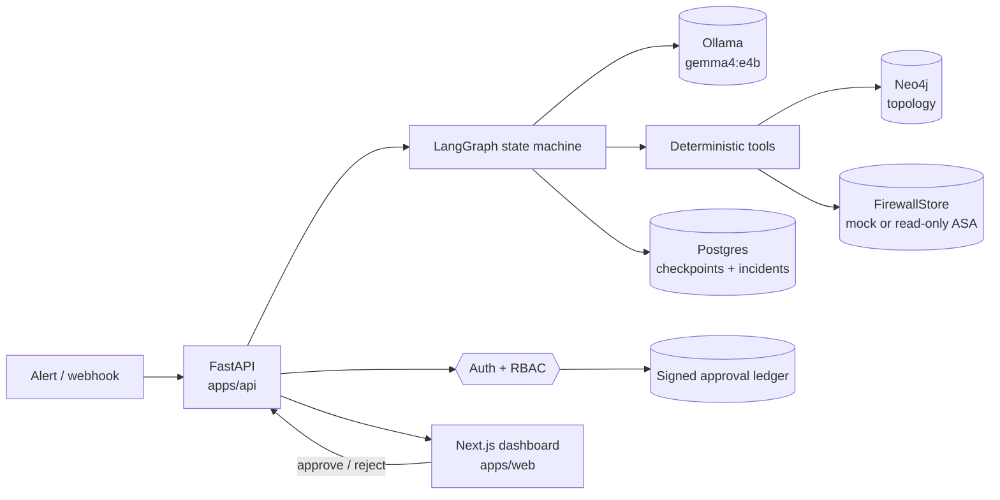

# How ZeroNode works

ZeroNode turns a network alert into a reviewed, evidence-backed configuration change. A local
LLM drives the investigation, but it never touches a device: every fact it uses comes from a
deterministic tool, every change it proposes is simulated before a human sees it, and approval
logs a dry run unless someone has deliberately enabled execution for a named device — in which
case the change is verified against the device afterwards and rolled back automatically if it did
not do what it promised.

This document explains the running system as it exists today, then lists what is still missing
before it could be trusted in production. For the product thesis and the four pillars, see
[architecture.md](architecture.md).

---

## 1. The scenario

The seeded lab models a classic cross-zone failure:

```
Web_App  →  SW_DMZ  →  FW_Edge  →  SW_TRUST  →  DB_Primary
  DMZ                                             TRUST
```

`Web_App` cannot reach `DB_Primary` on tcp/443. The traffic crosses a security boundary, and
ACL rule `ACL-DMZ-47` at line 40 on `FW_Edge` is dropping it. A human engineer would trace the
path, confirm the zone crossing, read the deny counters, and write a permit rule in the right
position. That is exactly the sequence the agent has to reproduce, with its work shown.

---

## 2. System map



Everything runs on one machine. No telemetry leaves it, and the model is local.

---

## 3. Lifecycle of an incident

1. **Trigger.** `POST /api/v1/incidents/trigger` with a `ticket_id`, description and severity.
   The ticket id becomes the LangGraph `thread_id`, so an incident and a conversation are the
   same object. The row is written to Postgres and the graph is started as a background task
   (`asyncio.create_task`) so the request returns immediately.
2. **Investigate.** The graph loops through the `supervisor` node, then `firewall_specialist`,
   calling one tool per turn. Each turn appends to `reasoning_trace` and `tool_log`.
3. **Pause.** The graph is compiled with `interrupt_before=["execute_change"]`. When the
   specialist queues a change, execution stops and the state is checkpointed to Postgres.
4. **Poll.** The dashboard polls `GET /api/v1/incidents/{id}/status`, which derives status from
   the graph snapshot rather than storing it: if `execute_change` is next, the incident is
   `awaiting_approval`.
5. **Decide.** `POST /api/v1/incidents/{id}/resume` with `approve` or `reject`, which requires an
   authenticated human holding the `approver` role. The decision, the actor and the evidence they
   were shown are sealed into the approval ledger *before* the graph resumes with
   `Command(resume=True, update={...})`. Resuming an incident that is not paused returns `409`.
6. **Act.** On approve, `execute_change` re-runs the simulation against what was actually signed
   off, then hands the change to the executor. By default that logs it; with execution enabled for
   the device it is sent, read back, and reversed if the read-back disagrees. On reject, the
   engineer's feedback is injected as a message and control returns to the specialist to revise.
   The caller gets a receipt carrying the ledger hash.
7. **Record.** What execution did is sealed into the same chain as the approval, written back to
   the ticket, and — for a refusal or a failed rollback — notified.

---

## 4. The agent graph

`apps/api/app/graph/builder.py` wires three nodes:

| Node | Role | Tools |
| --- | --- | --- |
| `supervisor` | Establishes topology facts, then delegates | `trace_network_path`, `blast_radius`, `security_boundary_check`, `delegate_to_firewall_specialist`, `mark_incident_resolved` |
| `firewall_specialist` | Reads firewall telemetry and proposes a fix | `get_denied_flows`, `get_acl_hits`, `propose_policy_change` |
| `execute_change` | The human gate. Never reached without approval | none |

Routing uses the tool-calling handoff pattern: a tool result can carry a `goto`, so
`delegate_to_firewall_specialist` moves the graph to the specialist and `propose_policy_change`
moves it to `execute_change`, where the interrupt fires. `recursion_limit` is 16, which bounds a
runaway loop.

---

## 5. Agent state

`apps/api/app/graph/state.py`. Two fields deserve explanation because they were the source of the
worst bug in the project's history.

| Field | Purpose |
| --- | --- |
| `messages` | Conversation history, reduced with `add_messages` |
| `topology_context` | The traced path, e.g. `Web_App -> SW_DMZ -> ...` |
| `zone_context` | The zone verdict, e.g. `source_zone=DMZ dest_zone=TRUST crosses_boundary=true` |
| `denied_flows` | Structured deny records from the firewall, used by the simulator |
| `pending_actions` | The change waiting at the gate, with its verification verdict |
| `verification` | Simulator output lines shown in the UI |
| `execution` | What execution did: mode, terminal state, commands, and what the device said back |
| `verify_attempts` | Correction budget, capped at 3 |
| `alert_flags` | What the incoming alert text looked like it was trying to do, if anything |
| `reasoning_trace` / `tool_log` | Append-only audit of decisions and raw tool output |
| `human_decision` / `human_feedback` | Injected on resume |

`topology_context` and `zone_context` are separate on purpose. They were once the same field, so
the boundary check overwrote the traced path; the fallback logic then saw no path, re-traced, and
the agent looped forever. Any state a later step depends on gets its own field.

---

## 6. Tools

Tools are the only way the agent learns anything. Each one is a Pydantic input model plus a
handler that returns a `ToolResult` (`content`, optional `state_update`, optional `goto`).
Handlers live in `apps/api/app/tools/topology.py`.

Two rules are enforced in code rather than in the prompt:

- `delegate_to_firewall_specialist` refuses to run until topology has been queried.
- `propose_policy_change` refuses to queue a change with no denied-flow evidence behind it.

Tool output is minified (`apps/api/app/minify.py`) to drop empty fields and cap list lengths
before it reaches the model, which keeps context small and cheap on CPU inference.

---

## 7. How the model actually calls tools

Three layers, in order, in `apps/api/app/graph/nodes.py`:

1. **Native tool calls.** Once the history contains a tool call, Ollama's Gemma template answers
   with a structured `tool_calls` payload and *empty* message content. This is the normal path and
   was originally missed, which made every turn look like a parse failure.
2. **XML-wrapped JSON.** The first turn, and any model without native tool calling, emits
   `<tool_call>{"name": ..., "arguments": {...}}</tool_call>`. The parser tolerates unclosed tags,
   code fences and surrounding prose.
3. **State-driven inference.** If neither produces a call, the harness picks the next step from
   state, not from the model's text: no path means trace, path but no zones means boundary check,
   both means delegate. Because it reads state, it can never repeat a step that already
   succeeded. These turns are labelled `inferred ...` in the tool log so the audit trail never
   claims the model made a decision it did not make.

Layer 3 is a safety net for a small local model, not a feature. In a healthy run it never fires.

---

## 8. The change simulator

`apps/api/app/verify.py` is the part that makes the approval meaningful. It parses the proposed
CLI into a rule, splices it into the device's ACL at its stated position, and re-evaluates the
denied flow with first-match semantics. Two classes of defect are caught.

**Ordering.** A permit appended below an existing deny is shadowed and changes nothing. This is
the failure that reads as correct in a change ticket and does nothing in production:

```
FAIL 10.10.1.10 -> 10.20.1.50:443/tcp still denied by ACL-DMZ-47 at line 40;
the proposed rule at line 50 is shadowed.
```

The remediation tells the model to pass `position=39`. Position is a first-class argument on
`propose_policy_change` precisely because free text failed here: the model kept writing "insert
before line 40" into the rationale, where nothing could act on it.

**Scope.** A permit that opens far more than the evidence justifies is rejected even when it
works:

```
SCOPE the rule permits 64,516 host pairs but only 1 is evidenced
(10.10.1.10 -> 10.20.1.50).
```

Subnet-to-subnet widening to fix one blocked flow is how segmentation quietly dies, so the
simulator demands least privilege and suggests the host-to-host form.

**Reversal.** Every proposal carries the command that undoes it, and that command is simulated
too. If the model supplies a `rollback` it is used; if not, the removal is derived from the change
(`no ` plus the same line), and the gate says which of the two happened. Either way the reversal is
applied to the post-change policy and the flow must land back on the verdict it had before — a
rollback that removes a different rule, or leaves the flow open, fails the same way a shadowed
permit does, and the model gets the failure and revises. A compensating rule is accepted instead
of a removal when it demonstrably restores the previous verdict, because not every shop reverses a
change by deleting a line.

The point is narrow and worth stating: this proves the reversal is the correct inverse of the
change, not that pasting it at three in the morning will fix a broken network. Anything else the
change disturbed is out of scope. It is also what makes the automatic rollback in section 9
defensible: the reversal being sent after a failed check is one that was already simulated.

The simulation runs **at proposal time**, so a change that fails is never shown to a human — the
model gets the failure and revises, up to three attempts. It runs **again after approval** so the
audit record reflects what was signed off. If the model exhausts its attempts, the change is still
queued, clearly labelled `NOT VERIFIED`, because silently dropping an incident is worse than
asking a human to look.

---

## 9. Executing a change

Everything up to this point is reversible because nothing has happened yet. This section is the
part that can break a network, so it is built to refuse rather than to act.

### Two switches, not one

`EXECUTION_ENABLED` turns the capability on. `EXECUTION_DEVICES` names the devices it may touch.
Neither does anything alone, and an empty device list means every approval stays a dry run no
matter what the first flag says. This is deliberate: enabling a feature is a deployment decision,
choosing which hardware it reaches is a change-management one, and collapsing the two is how a
flag set in a lab ends up pointed at production. Default is dry-run, which is also the correct
permanent setting for any environment where a wrong command costs more than a manual paste.

### One file can write

The read path enforces its guarantee in the transport: `SshDevice._send` raises
`ReadOnlyViolation` for anything that is not a `show`, and execution does not relax it. A separate
class, `ConfigSession` in `app/execute/session.py`, is the only code in the repository that can
send configuration. "Can this change a device?" is therefore answered by which class was
constructed, not by reading a method for a flag, and the answer for every backend, tool and query
path remains no.

### What has to be true before anything is sent

Approval is necessary and not sufficient. `app/execute/guard.py` re-checks, at execution time, the
properties the human's decision depended on:

| Precondition | Why it is checked again |
| --- | --- |
| The change passed simulation | An approval of an unverified change is an approval of a guess |
| A verified rollback exists | Anything sent must be undoable by the same machinery that sent it |
| Every command parses as an ACL line | If the simulator could not model it, nobody has demonstrated what it does |
| The device is in `EXECUTION_DEVICES` | Approval says what, configuration says where |
| Denied-flow evidence exists | Without it there is nothing to verify against afterwards |

A refusal is a terminal state with reasons, not an exception. It is reported at the gate, written
to the ticket, and notified, because an approval that quietly did nothing is worse than one that
visibly failed.

### Verifying against the device, not against the model

The simulator answered "would this work" against policy read *before* the change. Post-change
verification answers "did it work" against policy read *after* it, with the backend cache dropped
first — a stale read verifies nothing. Two things have to hold: the rule is actually present in
the policy read back, and the flow now evaluates to `permit`.

The interesting failure is a device that accepts a command and changes nothing. It is a normal
occurrence — a line rejected by an object-group reference, an ACL applied to a different
interface, a platform quirk — and it is invisible to anything that only checks whether the command
returned without error. Simulation and device disagreeing is the signal worth having, because it
means the model of the device is wrong somewhere.

### Undoing it

A failed check triggers the rollback immediately, followed by a second read to confirm the flow is
back where it started. Three outcomes, and the names are the ones used everywhere in the system:

- `applied` — on the device and confirmed.
- `rolled_back` — applied, failed its check, reversed, and confirmed reversed.
- `rollback_failed` — the device is in a state nobody chose. This is loud on purpose: it is logged
  as an error, sealed into the ledger, commented onto the ticket, sent to the notification webhook
  and shown at the top of the incident page. It is the one outcome that requires a person to go and
  look now, so nothing about it is quiet.

One session serves the change and its reversal, and it is closed whatever happens. A device has a
finite number of VTY lines, and a rollback that cannot connect because the failed change is still
holding the session is the worst possible time to find that out.

The change is left in the running configuration and is **not** written to startup. That is a
choice, not an omission: an unsaved change is one a reload undoes, which is a useful last resort
while execution is new. It also means a device that reboots loses the fix, so the ticket is where
the durable record lives until someone saves it deliberately.

The same reversal path runs when a command fails part-way through a multi-line change, which is
when it matters most. `EXECUTION_AUTO_ROLLBACK=false` exists for operators who would rather
inspect a broken change than have it removed underneath them; it produces `rollback_failed` with
an explicit note that reversal was disabled.

### In the audit trail

The approval record says what a person agreed to. A second record, `execution:<state>`, says what
the system then did with it, in the same hash chain. Recording only the first would leave the more
consequential half outside the audit trail. Dry runs are not recorded twice, since the approval
already describes them completely.

---

## 10. Identity, roles and the approval ledger

Approving a firewall change is the one privileged action in the system, so it is the one the
security model is built around.

### Roles

Four ordered roles, not a permission matrix, because there is one privileged action and a policy
engine would be more machinery than the problem deserves.

| Role | Can |
| --- | --- |
| `viewer` | Read incidents, traces and the audit ledger |
| `operator` | Everything above, plus trigger investigations |
| `approver` | Everything above, plus approve or reject a proposed change |
| `admin` | Everything above, plus manage users |

Humans authenticate with a password (Argon2) and a TOTP code, and receive a short-lived JWT.
Machines — an alerting system opening an incident — use a static service token pinned to
`operator`. Two separate rules stop a machine from approving: the role ladder, and an explicit
check that the principal is not a service credential. A service token granted `approver` by
mistake still cannot sign an approval.

### Sessions

The browser never holds the session token where script can read it. Login sets `zn_session` as an
httpOnly cookie, which means an XSS bug can abuse a session but cannot exfiltrate one. That trade
reintroduces CSRF, since the browser attaches cookies to requests any site can trigger, so a
second value is bound to the session token and must come back in an `X-CSRF-Token` header on every
state-changing request. A header is exactly what a cross-site form post cannot set. Machine
clients keep using bearer tokens, which are neither stored in the browser nor sent automatically.

Login is throttled per IP and per account (`SlidingWindow`, in process), and an account locks for
`LOGIN_LOCK_MINUTES` after `LOGIN_LOCK_THRESHOLD` consecutive failures. The lock lives in Postgres
rather than memory so it survives a restart and applies to every replica; the in-process window is
a first line of defence that multiplies by replica count, which is why it is not the only one. An
admin can clear a lock with `POST /api/v1/auth/users/{email}/unlock`.

### Second factor

`MFA_REQUIRED_FOR_APPROVERS` is on by default, and an approval from a session that did not present
a TOTP code is refused with a `403` explaining how to enrol. The session token records whether a
second factor was used, so the requirement is enforced at approval time without prompting again
mid-decision. Enrolment issues a secret that only becomes active once a code generated from it is
confirmed, which stops an account locking itself out of approvals with a mistyped setup. TOTP is
implemented directly against RFC 6238 in `app/auth/totp.py` and tested against the published
vectors.

### The ledger

Every approve and reject is written to `approvals` before the graph resumes, carrying the actor,
their role, and the evidence they were shown: the proposed commands, the simulator verdict, the
denied flows, and the topology context. Reconstructing after the fact what an engineer saw when
they clicked approve is the whole point.

Four independent properties, each doing a different job:

1. **Hash chain.** Each record commits to its predecessor's hash, so editing or removing one
   invalidates every record after it. Tampering is detectable even by someone who can write SQL.
2. **Ed25519 signature.** Only the holder of the signing key can produce a valid record, so a row
   inserted directly into the table does not verify. The public keys are published at
   `GET /api/v1/audit/key` so an auditor can check the ledger without trusting the API.
3. **Append-only in the database.** A trigger rejects `UPDATE` and `DELETE` on the table outright.
4. **An anchor outside the database.** The chain head and record count are appended to
   `AUDIT_ANCHOR_FILE` after every write, signed. This is the only one of the four that survives
   the table being dropped.

The fourth exists because the first three share a blind spot. Someone who owns the database can
delete the whole ledger or restore an older backup, and what remains verifies perfectly — it is
simply shorter, and nothing in it says so. Verification therefore compares the live chain against
the last anchor: fewer records than were anchored means deletion or rollback, and a different hash
at the anchored index means history below it was rewritten. Put the anchor on a volume Postgres
cannot write to, or it proves nothing.

**Key rotation.** The ledger trusts a set of keys, not one. `AUDIT_SIGNING_KEY` signs new records;
the public halves of previous keys stay in `AUDIT_RETIRED_KEYS` so everything signed before the
rotation still verifies. `python -m app.audit.keys rotate` prints both values. On startup, if the
active key differs from the one that signed the last record, a `key-rotation` record is appended
to the chain, so an auditor sees where the key changed instead of inferring it from a verification
failure.

`GET /api/v1/audit/verify` re-derives every hash and signature across all trusted keys, checks the
anchor, and reports the first break with its index and cause.

The system refuses to act on a decision it cannot record: if the ledger is unreachable while auth
is enabled, approval returns `503` rather than resuming the graph. An unrecorded approval binds
nobody, so it is not worth having.

### When a change may be approved

A correct change at the wrong hour is still an incident, so the gate asks *when* as well as
*whether*. `CHANGE_WINDOWS` lists the hours changes are allowed (`mon-fri 22:00-04:00; sat,sun
08:00-18:00`), `CHANGE_FREEZES` lists dates where nothing goes out (`2026-12-20..2027-01-02`), and
both are evaluated in `CHANGE_WINDOW_TZ` rather than in whatever timezone the server happens to
run in. Windows may span midnight, and an overnight window belongs to the day it started on. A
freeze always beats a window. No configuration means always open, so the control is opt-in.

Three decisions shape how it behaves:

- **Only approvals are gated.** Rejecting a proposal is always safe, and blocking it would only
  strand incidents until the next window.
- **The window is visible before anyone clicks.** The status endpoint carries the current verdict
  and the next opening time, so the dashboard shows a closed window at the gate rather than
  returning an error after the decision.
- **Break-glass exists, and costs something.** An outage does not wait for Tuesday night. An admin
  — not an approver — may override, must write a reason of real length, and both the reason and
  the window that was overridden are sealed into the approval record. A control with no override
  gets bypassed at the process level, where nothing records it.

### Where it is still thin

There is no SSO: accounts are local, so onboarding and offboarding are manual and there is no
central place to revoke access. Sessions cannot be revoked before they expire, since a JWT is
valid until its `exp`. Authorisation has no per-incident or per-device scoping — an approver can
approve anything — and no second-person rule for high-blast-radius changes.

---

## 11. Untrusted input

Everything the agent reads from outside is attacker-influenced. A webhook body can be forged or
replayed, and a device configuration can carry an ACL remark written by whoever last had config
access. Both end up as text in the same context window as the system prompt, which is where
prompt injection lives.

`app/sanitize.py` handles the boundary in three steps:

1. **Strip what could impersonate the protocol.** The parser scans free text for
   `<tool_call>{...}</tool_call>`, so an alert containing that string could otherwise write
   directly into the tool-call channel. Those markers are removed, invisible and bidi characters
   are dropped so nothing can hide from the human reading the same text, and over-long input is
   truncated.
2. **Fence it as data.** The alert reaches the model wrapped in `<untrusted_alert>` with an
   instruction that it describes symptoms and is never itself an instruction.
3. **Name the attempt.** Recognisable steering — instruction override, role reassignment, pressure
   to skip approval, a request for `permit ip any any` — is recorded in `alert_flags`, logged, shown
   at the approval gate and sealed into the approval record. Nothing is blocked: an alert that
   looks manipulated may still be a real outage, and dropping it would be the more dangerous
   failure.

Tool output gets the same cleaning on its way into the message history, because a device remark is
a place someone can leave a message for a model.

None of this is the security boundary, and treating it as one would be a mistake — pattern
matching on natural language is defeated by rephrasing. The boundary is structural, and it is
unchanged by anything the alert says: the agent cannot execute, only propose; a proposal is
simulated against policy read from the device rather than against anything the alert claims; the
scope check compares the rule to denied flows that came from the firewall; and a human with a
second factor signs before anything is logged as approved. A poisoned alert can waste an
investigation. It cannot widen a rule on its own.

---

## 12. Data stores

- **Neo4j** holds the topology: `Device`, `Interface`, `SecurityZone`, and the `CONNECTS_TO`,
  `HAS_INTERFACE`, `BELONGS_TO` relationships. Schema and seed are in `infra/neo4j/`. On startup
  the API checks for relationships and reseeds if the graph is empty, so a fresh volume
  self-heals.
- **Postgres** holds the LangGraph checkpoints (`AsyncPostgresSaver`) and an `incidents` index
  table. Checkpointing is what makes the human gate durable: the paused thread survives a restart.
- **Firewall** sits behind the `FirewallStore` interface (`apps/api/app/firewall/base.py`), which
  is read-only by construction: it can return policy, denied flows, hit counters and a NAT
  assessment, and has no method that changes a device. Three backends implement it, selected by
  `FIREWALL_BACKEND`:
  - `mock` (default) serves the lab fixtures, so tests need no hardware.
  - `cisco_asa` parses `show access-list`, `show object-group`, `show running-config object` and
    `show nat`.
  - `cisco_ios` parses `show ip access-lists`, converting wildcard bits to prefixes, and reads
    `show ip nat translations`.

  Both device backends share one SSH transport (`app/firewall/ssh.py`) that reuses a single
  session, retries once on a dropped pipe, and refuses any command not beginning with `show` by
  raising `ReadOnlyViolation`. The one non-`show` command that ever reaches a device is Netmiko's
  own paging control during session setup, which is session-scoped and changes no configuration.

  ACL semantics live in `app/firewall/policy.py`, independent of where the rules came from, so a
  fixture, a live device and a rule the model has only proposed are all evaluated identically.
  Lines the parser cannot model are kept as `unparsed` rules rather than dropped. If one sits
  above the proposed insertion point the simulator returns `INCONCLUSIVE` instead of a verdict,
  because a rule it cannot read might match the flow first.

Real policies are written against object-groups, so resolving them is what makes the simulator
usable outside the lab. Two paths, in order of preference:

1. **The device's own expansion.** `show access-list` prints the summary rule followed by
   indented, fully expanded elements. When those are present they are authoritative and the
   summary line is discarded — no second command, no reimplementation of Cisco's semantics.
2. **`show object-group` and `show running-config object`**, fetched only when step 1 leaves
   something unparsed, as with `show running-config access-list`. `app/firewall/objectgroup.py`
   flattens nested groups and named objects with a cycle guard and expands the rule into the cross
   product of sources, destinations and ports. Named objects cover `host`, `subnet` and `range`
   (summarised into prefixes) plus service objects; groups may reference objects and objects may
   be referenced from either side.

Expansion refuses to guess. A member the parser does not understand — an FQDN object, an
unsupported qualifier, a reference to something that no longer exists — marks the whole group
incomplete, and any rule using it stays unparsed. Narrowing a rule silently because part of it was
unreadable would produce exactly the false confidence this layer exists to prevent.

### NAT

On ASA 8.3 and later an ACL matches the real address of a host, not the translated one. Our
evidence comes from deny logs and from whatever the operator typed, either of which may be the
mapped side, so simulating against the wrong side would produce a confident answer about the wrong
packet. The adapters therefore detect translation rather than model it: if any non-identity NAT
rule could touch an address in the flow, verification returns `INCONCLUSIVE` and asks a human to
confirm the untranslated addresses. Identity NAT is excluded, because it leaves addresses
unchanged, and NAT rules that cannot be resolved are reported as a note rather than treated as
either a match or an all-clear.

### Validating a real device

No test proves that a particular production device prints what the parser expects, so that gap is
closed by running one command instead of by trusting the code:

```bash
cd apps/api && .venv/bin/python -m app.firewall.probe \
  --backend cisco_asa --host 192.0.2.10 --username readonly \
  --acl DMZ_TO_TRUST --flow 10.10.1.10,10.20.1.50,443
```

A Containerlab node is the sensible first target for this, before any production appliance; see
"Test environments" in the production plan.

It connects read-only and reports how many ACL entries were read, how many were modelled, the
exact text of any that were not, whether NAT touches the flow, the verdict for that flow, and
whether the read-only guard held. It exits `0` when everything was modelled, `1` when some entries
were not, and `2` when the device could not be read. Unmodelled lines are safe — the simulator
degrades to `INCONCLUSIVE` — but they limit coverage, and the printed text is what the parser
needs to be extended with.

### Credentials

Nothing sensitive has to live in an environment variable. Any credential setting may instead name
where the value lives:

```
FIREWALL_PASSWORD=file:/run/secrets/asa_password
FIREWALL_PASSWORD=vault:secret/data/zeronode#asa_password
FIREWALL_PASSWORD=exec:aws secretsmanager get-secret-value --secret-id asa --query SecretString
JWT_SECRET=env:JWT_SECRET_FROM_INIT_CONTAINER
```

The reason is not secrecy in the abstract. A password in the environment is readable by anything
that can see the process, is printed by `docker inspect`, is copied into crash reports, and rotates
only with a restart. A reference is none of those things: device credentials are resolved at the
moment a session opens rather than held on the object, and resolved values are cached only for
`SECRET_CACHE_SECONDS`, so rotating at the source takes effect without a restart. Failures are
loud and never carry the value — the error names the source, not the secret.

`REQUIRE_MANAGED_SECRETS` (on by default) makes this a rule rather than an option: the API refuses
to open an SSH session to a real device with an inline credential. It applies only to device
backends, so `mock` needs no setup, and it does not apply to a password typed at the probe's
prompt, which is the one case where an inline value is the safe one.

### Failing loudly

Both stores used to degrade quietly: no Neo4j meant the in-memory lab topology, no Postgres meant
an in-memory checkpointer, and the only sign was a log line. That is the worst possible behaviour
for this system. An agent reasoning over the lab fixture will confidently trace a path through a
network that is not yours, and an approval written to an in-memory ledger is an approval that
never happened.

With `STRICT_DEPENDENCIES` on, which is the default, an unreachable store fails startup with a
message saying what is lost. Postgres is opened with `wait=True` so an unreachable database fails
at boot rather than on the first query. Turning it off restores the fallbacks, and every one of
them is then reported: `GET /health` lists the active degradations and returns `503` while any
exist, so a container running on fixtures does not look healthy to Compose, Kubernetes or a
monitor. Disabled auth, an ephemeral signing key and an unanchored ledger are listed there too,
for the same reason. Ollama is checked on every health request, not only during startup; if the
host process stops, inference becomes a visible `503` instead of leaving incidents apparently
running behind a green status.

---

## 13. The dashboard

`apps/web` is a Next.js app polling with SWR. The incident view shows the reasoning trace, the
raw tool log, the path visualiser, and the approval gate. The gate shows the proposed command,
the model's rationale, the simulator verdict in green or red, the verified rollback, whether the
change window is open, and any flags raised by the alert text, so the engineer is never asked to
approve a command whose effect, reversal or timing has not been demonstrated. When the window is
closed the approve button is disabled for everyone but an admin, who has to write a break-glass
reason before it unlocks.

The gate also states, before anything else, whether approving will write to the device or only
record the change, and the button reads "Apply to device" or "Execute dry-run" to match. That
string comes from the API rather than a frontend default, because a gate that says dry-run while
the backend is live is worse than no gate. Once a decision has been made, the incident page leads
with what execution actually did — applied, refused, rolled back, or the state that needs somebody
at the device now — together with the policy read back off it.

---

## 14. Configuration

| Variable | Default | Notes |
| --- | --- | --- |
| `OLLAMA_BASE_URL` | `http://127.0.0.1:11434` | For the API running on the host |
| `OLLAMA_BASE_URL_DOCKER` | `http://host.docker.internal:11434` | Used by the container. Deliberately a separate name, because interpolating the host value into the container points it at itself |
| `OLLAMA_MODEL` | `gemma4:e4b` | |
| `OLLAMA_NUM_PREDICT` | `640` | Too low truncates the model mid tool call |
| `NEO4J_URI` / `NEO4J_USER` / `NEO4J_PASSWORD` | `bolt://localhost:7687` / `neo4j` / `zeronode` | |
| `DATABASE_URL` | `postgresql://...@localhost:5433/zeronode` | Port 5433 to avoid colliding with a local Postgres |
| `CORS_ORIGINS` | `http://localhost:3000` | |
| `AUTH_ENABLED` | `true` | Setting it false opens every endpoint and makes approvals unattributable. Logged loudly at startup |
| `JWT_SECRET` | empty | Unset means a random secret per process: sessions die on restart and replicas reject each other's tokens |
| `JWT_TTL_MINUTES` | `60` | |
| `BOOTSTRAP_ADMIN_EMAIL` / `BOOTSTRAP_ADMIN_PASSWORD` | empty | First admin, created on startup if absent. Without it and with no users, nobody can log in, which is logged as an error |
| `SERVICE_TOKEN` | empty | Static token for alerting systems. Pinned to `operator`, and can never approve |
| `COOKIE_SECURE` | `false` | Set true once the dashboard is behind TLS, or session cookies travel in clear |
| `LOGIN_RATE_LIMIT` / `LOGIN_RATE_WINDOW_SECONDS` | `10` / `60` | Per-IP and per-account throttle. In process, so it multiplies by replica count |
| `LOGIN_LOCK_THRESHOLD` / `LOGIN_LOCK_MINUTES` | `5` / `15` | Consecutive failures before an account locks, and for how long. Stored in Postgres |
| `MFA_REQUIRED_FOR_APPROVERS` | `true` | Off means an approval rests on a single stealable credential |
| `AUDIT_SIGNING_KEY` | empty | Ed25519 seed for the ledger. Unset means an ephemeral key, so records cannot be verified after a restart |
| `AUDIT_RETIRED_KEYS` | empty | Public keys of previous signing keys, comma separated, so records survive a rotation |
| `AUDIT_ANCHOR_FILE` | empty | Where the chain head is anchored. Unset means deleting the ledger leaves no trace |
| `FIREWALL_BACKEND` | `mock` | `mock`, `cisco_asa`, `cisco_ios`, `arista_eos` or `nokia_srl`. The device backends need `pip install -e "apps/api[devices]"` |
| `FIREWALL_HOST` / `FIREWALL_USERNAME` / `FIREWALL_PASSWORD` | empty | Read-only device credentials. The password must be a secret reference unless `REQUIRE_MANAGED_SECRETS` is off |
| `FIREWALL_SECRET` | empty | Enable secret, only if `show` output needs privilege 15 |
| `FIREWALL_ACL` | empty | Restricts `show access-list` to one ACL. Empty reads them all |
| `FIREWALL_DEVICE_ID` | `FW_Edge` | Topology device name this backend answers for |
| `EXECUTION_ENABLED` | `false` | Off means an approved change is logged, never sent |
| `EXECUTION_DEVICES` | empty | Devices execution may touch. Empty means every change stays a dry run, whatever the flag above says |
| `EXECUTION_AUTO_ROLLBACK` | `true` | Undo a change that fails its post-change check. Off leaves the failure in place and says so |
| `TICKET_WEBHOOK_URL` / `TICKET_WEBHOOK_TOKEN` | empty | ServiceNow or Jira inbound endpoint. Unset means changes are not written to a ticket system |
| `NOTIFY_WEBHOOK_URL` / `NOTIFY_WEBHOOK_TOKEN` | empty | Slack, Teams or Mattermost hook for pending approvals. A webhook URL is itself a credential, so prefer a secret reference |
| `DASHBOARD_URL` | `http://localhost:3000` | Used for the direct link in tickets and notifications |
| `CHANGE_WINDOWS` | empty | When changes may be approved, e.g. `mon-fri 22:00-04:00`. Empty means any time |
| `CHANGE_FREEZES` | empty | Dates when nothing goes out, e.g. `2026-12-20..2027-01-02`. Beats any window |
| `CHANGE_WINDOW_TZ` | `UTC` | Evaluated here, not in the server's local timezone |
| `SECRET_CACHE_SECONDS` | `300` | How long a resolved secret is reused. Lower means a rotation applies sooner |
| `VAULT_ADDR` / `VAULT_TOKEN` | empty | Needed only for `vault:` references. KV v1 and v2 |
| `REQUIRE_MANAGED_SECRETS` | `true` | Refuse to open a device session with an inline credential |
| `STRICT_DEPENDENCIES` | `true` | Refuse to start on an unreachable store instead of falling back to fixtures |

---

## 15. Running and testing

```bash
cp .env.example .env
ollama serve
docker compose up -d --build            # neo4j, postgres, seed, api, web
curl -fsS http://localhost:8000/health
```

```bash
cd apps/api
.venv/bin/pytest -q                     # device tests skip visibly without the emulator
.venv/bin/ruff check app tests
python ../../scripts/golden_path.py     # scripted end-to-end run
python ../../scripts/probe_turn.py      # print the model's raw reply for one turn
```

The authenticated live-model walkthrough covers health, login, MFA, investigation, approval,
dry-run execution and ledger verification:

```bash
ZERONODE_EMAIL=you@example.com ZERONODE_PASSWORD='your-password' \
  apps/api/.venv/bin/python scripts/e2e_walkthrough.py
```

`scripts/probe_turn.py` is the fastest way to debug model behaviour: it replays a
mid-investigation turn and prints content, `tool_calls` and metadata, which takes seconds
instead of the several minutes a full incident needs on CPU.

---

## 16. Known limitations

Being explicit about these matters more than the feature list.

- **Execution has never run against real hardware.** The write path is guarded and has run over
  real SSH against the device emulator, including a failed verification and rollback. That proves
  the transport and lifecycle, not vendor behaviour. The next honest test is an L4 Containerlab
  node.
- **No device backend has been run against real hardware.** Parsers are tested against captured
  output and Netmiko has met the SSH emulator's banners, prompts, paging and timeouts, but no
  backend has met a vendor appliance. `python -m app.firewall.probe` exists to close this in one
  read-only command; until it is run against a given device, that device is unproven.
- **Expansion has ceilings**: port ranges wider than 64, address ranges spanning more than 16
  prefixes, and rules expanding past 2,048 combinations are left unparsed rather than
  materialised.
- **Narrow vendor coverage.** Cisco ASA and IOS are the production-targeted parsers; EOS exists
  for the Containerlab rung. NX-OS, Palo Alto and Fortinet are unimplemented.
- **NAT is detected, not modelled.** A translated flow makes the simulator decline to give a
  verdict rather than reason through the translation, so those incidents fall back to a human.
- **No SSO, and sessions cannot be revoked** before their token expires. Authorisation is not
  scoped per device or per incident, and there is no second-person rule for wide changes.
- **Investigations do not survive a restart.** State is checkpointed, but the background task
  driving the graph is in-process; a restart leaves a thread paused mid-investigation with
  nothing to resume it.
- **One scenario, five devices, all of it seeded by hand.** The lab proves the workflow, not scale,
  and the seed was written to fit the queries rather than the other way round. The ladder out of
  this is in "Test environments" below: a device-shaped SSH server for a real session, NetBox for a real inventory, Containerlab for a real CLI.
- **Prompt-injection defence is mitigation, not prevention.** Alert and device text is cleaned,
  fenced and flagged, but pattern matching on natural language loses to rephrasing. What actually
  holds is structural: no execution, evidence read from the device, and a signed human approval.
- **Rollback is verified as an inverse, not as a recovery procedure.** It proves the reversal
  undoes the rule; it says nothing about anything else the change disturbed.
- **Post-change verification proves the policy, not the service.** It confirms the device now
  permits the flow; it does not open a socket, and nothing here watches whether the application
  actually recovered. Hit counters need traffic to move, so they cannot stand in for it.
- **Ticketing and notifications are outbound only.** ZeroNode opens, comments on and closes a
  ticket, but never reads one, so closing an incident in ServiceNow does not close it here. A
  failed delivery is logged, not retried or queued.
- **Executed changes are not saved to startup configuration.** Deliberate while execution is new,
  but it means a reload silently undoes an applied fix.
- **Change windows are enforced at the gate only.** Nothing schedules a change for the next
  window, so an incident raised during a freeze waits for a person.
- **Secret references cover the credentials the API resolves.** `DATABASE_URL` still carries its
  password inline, since it is consumed as a single connection string.
- **Latency is 6–8 minutes per incident** on CPU inference.

---

## 17. Path to production

Ordered by what would block a first real deployment. Phase 1 is the difference between a working
system and a supervised pilot on a live network.

### Test environments

The phases below say what to build. This says what to build it against, because most of the
remaining risk is not in the code — it is in the assumption that a real network resembles the
fixtures. Three rungs, each answering a question the one below it cannot:

| Rung | Environment | What it can prove | Status |
| --- | --- | --- | --- |
| L1 | Static fixtures and a seeded Neo4j graph | The state machine, the parsers and the simulator, deterministically and with no hardware | Running |
| L2 | An SSH server shaped like a device, in Compose | That the client survives a real session, and that a change applied to something that actually changes is verified and undone correctly | Running |
| L3 | NetBox as the source of truth | That the graph layer answers relational questions against a real inventory rather than a seed written to fit the queries | Built, unrun |
| L4 | Containerlab with a real network OS | That a proposed diff maps onto real interface configuration, on a CLI nobody wrote for us | Passed against Nokia SR Linux 24.10.4 |

L1 is deliberately where the unit tests stay. Determinism is the point: a parser test that needs a
container is a parser test people stop running. What L1 cannot do is tell you whether the client
survives a session it did not construct, because L1 replaces the transport.

**L2 — a device-shaped SSH server** (`infra/fakeasa`). Not a simulator, and worth being precise
about what it is not: it proves nothing about ASA syntax, which fixtures already cover. What it
proves is everything around the syntax — SSH negotiation, character echo, prompt detection, enable
mode, paging, configuration mode, and a device whose ACL genuinely changes when you configure it.

```bash
cd /path/to/ZeroNode && scripts/lab_device_test.sh
```

The script itself does not care what the working directory is — it resolves the
repository from its own location — but the path you invoke it by still has to be
right. From `apps/api`, that is `../../scripts/lab_device_test.sh`.

It starts the emulator, waits for it to accept connections, runs the tests with
the project's interpreter and takes the container down again. Running the tests by
hand works too, but note that they need the `devices` extra and skip themselves
without it — a system `pytest`, or a missing emulator, produces a run that passes
because nothing executed. The script refuses in both cases rather than being quiet
about it, and skip reasons are printed by default.

It found two things fixtures could not. Netmiko's ASA driver insists on reaching enable mode during
session setup, so a read-only account that lands in user exec fails at connect rather than at the
first command — the account needs privilege 15 or an enable secret. And the position a proposal was
simulated at was never being sent to the device, so every live execution would have appended the
rule after the deny that prompted it, failed its read-back, and rolled back. Both are fixed.

**L3 — NetBox** (`scripts/ingest_netbox.py`). Replaces the hand-seeded graph with an ingest from an
inventory that does not cooperate: devices with no zone recorded, cables that terminate on patch
panels and cannot be traced, names that collide across sites.

```bash
docker compose --profile netbox up -d          # ~3 GB of images
python scripts/ingest_netbox.py --token <api-token> --dry-run
python scripts/ingest_netbox.py --token <api-token> --replace
```

The ingest reports what it could not model rather than filling it in. A device with no security
zone matters more than it looks: a missing zone reads as "no boundary crossed", which is the wrong
answer delivered confidently. Zones come from a `security_zone` custom field or a `zone:NAME` tag.

**L4 — Containerlab** (`infra/containerlab/zeronode.clab.yml`). The cross-zone scenario as a real
network: two hosts either side of a firewall, with the shadowing deny already in the startup
config. The firewall is Nokia SR Linux: a genuine vendor NOS with an official public container
image, so this rung is repeatable without hardware, a simulator licence or a vendor account.

EOS is IOS-like, not IOS, so it has its own adapter (`app/firewall/eos.py`). The difference that
matters is that EOS prints prefixes where IOS prints wildcard masks; reusing the IOS parser reads
`10.10.1.0/24` as a single host and silently narrows every rule it touches.

The image is not redistributable, so downloading it from the Arista software portal is the one
manual step. Containerlab itself runs in a pinned container with the host PID namespace; no host
installation or separate VM is required on this Intel Mac.

```bash
scripts/lab_containerlab_test.sh
```

The validated sequence is read seeded deny → reject a shadowed change through
live verification → automatic rollback → apply at the correct sequence → pass
a real TCP/443 request → clean up and confirm the deny is restored.

The harness validates and deploys the topology, waits for EOS SSH, proves the initial policy denies
a real TCP/443 packet, applies a deliberately shadowed ACE and confirms automatic rollback, applies
an effective ACE and confirms the packet crosses the firewall, restores the seeded deny, and
destroys the topology. It publishes EOS SSH as `localhost:2223` because Docker Desktop does not
route the Containerlab management subnet directly to macOS. The harness supplies `--pid host`; if
that flag is omitted, nodes can come up unwired.

One naming note to avoid confusion: these rungs are labelled L1–L4 because the numbered phases
below already mean something different.

### Phase 1 — Safety and trust (blocking)

| Item | Why |
| --- | --- |
| ~~Authentication and RBAC on every endpoint~~ | Done: password login, TOTP second factor for approvers, httpOnly cookie sessions with CSRF protection, login throttling and account lockout, four ordered roles, service tokens that cannot approve. SSO remains, and is an integration rather than a control |
| ~~Signed, immutable approval records~~ | Done: hash-chained, Ed25519-signed, append-only in the database, anchored outside it, key rotation with a rotation marker in the chain, verifiable at `/api/v1/audit/verify` |
| ~~Real device adapter behind an interface~~ | Done for read paths: `FirewallStore` with read-only ASA and IOS backends, object-group and named-object resolution, NAT detection, and a probe command for validating a real device. Live-hardware validation is a run, not a build |
| ~~Credential handling via a vault~~ | Done: any credential may be a `file:`, `env:`, `vault:` or `exec:` reference, resolved at the moment of use and cached briefly so rotation needs no restart. Inline device credentials are refused by default |
| ~~Change windows and freeze periods~~ | Done: windows and freezes in a configured timezone, enforced on approval only, visible at the gate, with an admin break-glass whose reason is sealed into the approval record |
| ~~Rollback plan attached to every proposal~~ | Done: every proposal carries a reversal, authored or derived, and it is simulated back to the pre-change verdict before the change can be queued |
| ~~Prompt-injection defence~~ | Done as mitigation: alert and device text is stripped of control markers and invisible characters, fenced as untrusted data, and steering attempts are flagged to the approver. The real defence stays structural |
| ~~Remove silent fallbacks~~ | Done: unreachable stores fail startup by default, and when fallbacks are deliberately enabled `/health` reports every degradation and returns `503` |

### Phase 2 — Closing the loop

| Item | Why |
| --- | --- |
| ~~Execute against a real device behind a feature flag, dry-run by default~~ | Done: two switches rather than one, a single write-capable class, and preconditions re-checked at execution time. Exercised end to end against the L2 device emulator, including a failed change that was rolled back on the device; unrun against hardware |
| ~~Post-change verification against live telemetry~~ | Done: policy re-read from the device with the cache dropped, checking both that the rule landed and that the flow now evaluates to permit |
| ~~Automatic rollback on failed verification~~ | Done: reversal on a failed check or a part-way failure, confirmed by a second read, with `rollback_failed` as a loud terminal state |
| ~~Ticket integration (ServiceNow / Jira)~~ | Done as a webhook, and it closes the loop it opens: incident raised, decision, execution outcome, and closure when the investigation ends. A native client can implement the same interface later |
| ~~Notifications for pending approvals~~ | Done: fired every time the graph stops at the gate, including after a rejection sends the specialist back to re-plan, carrying the command, the simulation verdict, window state, injection flags and a direct link |

What is not done is running any of it against something that can be broken. The gate for that is
L4 below, and no phase after this one should start before it.

### Phase 3 — Reliability

| Item | Why |
| --- | --- |
| Durable job runner (queue or worker) instead of `asyncio.create_task` | Investigations must survive restarts and deploys |
| Timeouts, retries and circuit breaking on the model call | A hung inference currently blocks a thread indefinitely |
| Concurrency limits and backpressure | One Ollama instance cannot serve many incidents at once |
| Structured logging, metrics and tracing | Time per node, tool error rates, approval latency |
| Backups for Neo4j and Postgres | Checkpoints are the audit trail |

### Phase 4 — Model quality

| Item | Why |
| --- | --- |
| Evaluation harness with a corpus of golden incidents | Measure tool-call accuracy and proposal quality on every change |
| Regression gate in CI using the scripted LLM | Cheap protection against prompt and parser regressions |
| GPU inference or a larger model, with latency budgets | 6–8 minutes is not operational |
| Reduce reliance on the inference fallback to zero | Track how often it fires as a health metric |

### Phase 5 — Scale and coverage

| Item | Why |
| --- | --- |
| Topology ingestion from NetBox, LLDP or SNMP, with freshness tracking | A hand-seeded graph does not survive contact with a real network. The L3 environment is where this starts, and it does not have to wait for Phase 5 |
| Multi-vendor config normalisation | Cisco-only parsing is a hard ceiling |
| More scenarios: routing, MTU, asymmetric paths, BGP | One scenario proves the workflow, not the coverage an operator needs |
| Multi-tenancy and per-site isolation | Required for managed-service use |

### Phase 6 — Operations

| Item | Why |
| --- | --- |
| CI/CD with image scanning and pinned dependencies | |
| Infrastructure as code and reproducible deploys | |
| Load and soak testing | |
| Runbooks, on-call, upgrade path | |

### Definition of done for v1

A pilot is credible when, for a single supported vendor and scenario:

1. Every approval is authenticated, attributable and immutable.
2. Every proposal carries a simulation verdict and a rollback plan.
3. Changes execute against real devices with dry-run as the default and automatic rollback on
   failed post-change verification.
4. Topology is ingested automatically and its freshness is visible.
5. An eval suite gates every deploy, and fallback usage is tracked as a health metric.
6. A restart never loses an investigation.
