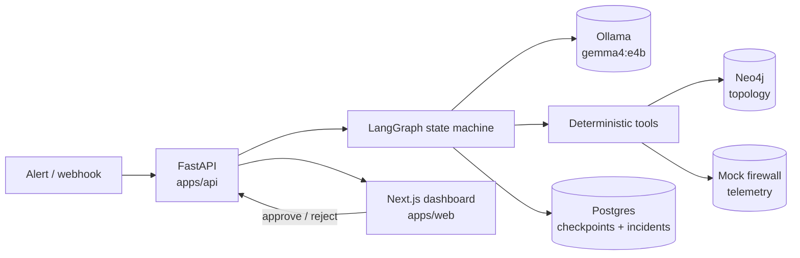

# How ZeroNode works

ZeroNode turns a network alert into a reviewed, evidence-backed configuration change. A local
LLM drives the investigation, but it never touches a device: every fact it uses comes from a
deterministic tool, every change it proposes is simulated before a human sees it, and approval
only ever logs a dry run.

This document explains the running system as it exists today, then lists what is still missing
before it could be trusted in production. For the product thesis and the four pillars, see
[architecture.md](architecture.md).

---

## 1. The scenario

The seeded lab models a classic cross-zone failure:

```
Web_App  →  SW_DMZ  →  FW_Edge  →  SW_TRUST  →  DB_Primary
  DMZ                                             TRUST
```

`Web_App` cannot reach `DB_Primary` on tcp/443. The traffic crosses a security boundary, and
ACL rule `ACL-DMZ-47` at line 40 on `FW_Edge` is dropping it. A human engineer would trace the
path, confirm the zone crossing, read the deny counters, and write a permit rule in the right
position. That is exactly the sequence the agent has to reproduce, with its work shown.

---

## 2. System map



Everything runs on one machine. No telemetry leaves it, and the model is local.

---

## 3. Lifecycle of an incident

1. **Trigger.** `POST /api/v1/incidents/trigger` with a `ticket_id`, description and severity.
   The ticket id becomes the LangGraph `thread_id`, so an incident and a conversation are the
   same object. The row is written to Postgres and the graph is started as a background task
   (`asyncio.create_task`) so the request returns immediately.
2. **Investigate.** The graph loops through the `supervisor` node, then `firewall_specialist`,
   calling one tool per turn. Each turn appends to `reasoning_trace` and `tool_log`.
3. **Pause.** The graph is compiled with `interrupt_before=["execute_change"]`. When the
   specialist queues a change, execution stops and the state is checkpointed to Postgres.
4. **Poll.** The dashboard polls `GET /api/v1/incidents/{id}/status`, which derives status from
   the graph snapshot rather than storing it: if `execute_change` is next, the incident is
   `awaiting_approval`.
5. **Decide.** `POST /api/v1/incidents/{id}/resume` with `approve` or `reject`. This resumes the
   interrupted graph with `Command(resume=True, update={...})`. Resuming an incident that is not
   paused returns `409`.
6. **Record.** On approve, `execute_change` re-runs the simulation, writes a `DRY-RUN approved
   (VERIFIED|NOT VERIFIED)` summary and ends. On reject, the engineer's feedback is injected as a
   message and control returns to the specialist to revise.

---

## 4. The agent graph

`apps/api/app/graph/builder.py` wires three nodes:

| Node | Role | Tools |
| --- | --- | --- |
| `supervisor` | Establishes topology facts, then delegates | `trace_network_path`, `blast_radius`, `security_boundary_check`, `delegate_to_firewall_specialist`, `mark_incident_resolved` |
| `firewall_specialist` | Reads firewall telemetry and proposes a fix | `get_denied_flows`, `get_acl_hits`, `propose_policy_change` |
| `execute_change` | The human gate. Never reached without approval | none |

Routing uses the tool-calling handoff pattern: a tool result can carry a `goto`, so
`delegate_to_firewall_specialist` moves the graph to the specialist and `propose_policy_change`
moves it to `execute_change`, where the interrupt fires. `recursion_limit` is 16, which bounds a
runaway loop.

---

## 5. Agent state

`apps/api/app/graph/state.py`. Two fields deserve explanation because they were the source of the
worst bug in the project's history.

| Field | Purpose |
| --- | --- |
| `messages` | Conversation history, reduced with `add_messages` |
| `topology_context` | The traced path, e.g. `Web_App -> SW_DMZ -> ...` |
| `zone_context` | The zone verdict, e.g. `source_zone=DMZ dest_zone=TRUST crosses_boundary=true` |
| `denied_flows` | Structured deny records from the firewall, used by the simulator |
| `pending_actions` | The change waiting at the gate, with its verification verdict |
| `verification` | Simulator output lines shown in the UI |
| `verify_attempts` | Correction budget, capped at 3 |
| `reasoning_trace` / `tool_log` | Append-only audit of decisions and raw tool output |
| `human_decision` / `human_feedback` | Injected on resume |

`topology_context` and `zone_context` are separate on purpose. They were once the same field, so
the boundary check overwrote the traced path; the fallback logic then saw no path, re-traced, and
the agent looped forever. Any state a later step depends on gets its own field.

---

## 6. Tools

Tools are the only way the agent learns anything. Each one is a Pydantic input model plus a
handler that returns a `ToolResult` (`content`, optional `state_update`, optional `goto`).
Handlers live in `apps/api/app/tools/topology.py`.

Two rules are enforced in code rather than in the prompt:

- `delegate_to_firewall_specialist` refuses to run until topology has been queried.
- `propose_policy_change` refuses to queue a change with no denied-flow evidence behind it.

Tool output is minified (`apps/api/app/minify.py`) to drop empty fields and cap list lengths
before it reaches the model, which keeps context small and cheap on CPU inference.

---

## 7. How the model actually calls tools

Three layers, in order, in `apps/api/app/graph/nodes.py`:

1. **Native tool calls.** Once the history contains a tool call, Ollama's Gemma template answers
   with a structured `tool_calls` payload and *empty* message content. This is the normal path and
   was originally missed, which made every turn look like a parse failure.
2. **XML-wrapped JSON.** The first turn, and any model without native tool calling, emits
   `<tool_call>{"name": ..., "arguments": {...}}</tool_call>`. The parser tolerates unclosed tags,
   code fences and surrounding prose.
3. **State-driven inference.** If neither produces a call, the harness picks the next step from
   state, not from the model's text: no path means trace, path but no zones means boundary check,
   both means delegate. Because it reads state, it can never repeat a step that already
   succeeded. These turns are labelled `inferred ...` in the tool log so the audit trail never
   claims the model made a decision it did not make.

Layer 3 is a safety net for a small local model, not a feature. In a healthy run it never fires.

---

## 8. The change simulator

`apps/api/app/verify.py` is the part that makes the approval meaningful. It parses the proposed
CLI into a rule, splices it into the device's ACL at its stated position, and re-evaluates the
denied flow with first-match semantics. Two classes of defect are caught.

**Ordering.** A permit appended below an existing deny is shadowed and changes nothing. This is
the failure that reads as correct in a change ticket and does nothing in production:

```
FAIL 10.10.1.10 -> 10.20.1.50:443/tcp still denied by ACL-DMZ-47 at line 40;
the proposed rule at line 50 is shadowed.
```

The remediation tells the model to pass `position=39`. Position is a first-class argument on
`propose_policy_change` precisely because free text failed here: the model kept writing "insert
before line 40" into the rationale, where nothing could act on it.

**Scope.** A permit that opens far more than the evidence justifies is rejected even when it
works:

```
SCOPE the rule permits 64,516 host pairs but only 1 is evidenced
(10.10.1.10 -> 10.20.1.50).
```

Subnet-to-subnet widening to fix one blocked flow is how segmentation quietly dies, so the
simulator demands least privilege and suggests the host-to-host form.

The simulation runs **at proposal time**, so a change that fails is never shown to a human — the
model gets the failure and revises, up to three attempts. It runs **again after approval** so the
audit record reflects what was signed off. If the model exhausts its attempts, the change is still
queued, clearly labelled `NOT VERIFIED`, because silently dropping an incident is worse than
asking a human to look.

---

## 9. Data stores

- **Neo4j** holds the topology: `Device`, `Interface`, `SecurityZone`, and the `CONNECTS_TO`,
  `HAS_INTERFACE`, `BELONGS_TO` relationships. Schema and seed are in `infra/neo4j/`. On startup
  the API checks for relationships and reseeds if the graph is empty, so a fresh volume
  self-heals.
- **Postgres** holds the LangGraph checkpoints (`AsyncPostgresSaver`) and an `incidents` index
  table. Checkpointing is what makes the human gate durable: the paused thread survives a restart.
- **Mock firewall** (`apps/api/app/mocks/firewall.py`) provides denied flows and ACL hit
  counters. This is the largest piece of fiction in the system and the first thing to replace.

Both stores degrade rather than crash: without Neo4j the API uses an in-memory copy of the lab
topology, and without Postgres it uses an in-memory checkpointer. Convenient for development,
dangerous in production, since the fallback is silent apart from a log line.

---

## 10. The dashboard

`apps/web` is a Next.js app polling with SWR. The incident view shows the reasoning trace, the
raw tool log, the path visualiser, and the approval gate. The gate shows the proposed command,
the model's rationale, and the simulator verdict in green or red, so the engineer is never asked
to approve a command whose effect has not been demonstrated.

---

## 11. Configuration

| Variable | Default | Notes |
| --- | --- | --- |
| `OLLAMA_BASE_URL` | `http://127.0.0.1:11434` | For the API running on the host |
| `OLLAMA_BASE_URL_DOCKER` | `http://host.docker.internal:11434` | Used by the container. Deliberately a separate name, because interpolating the host value into the container points it at itself |
| `OLLAMA_MODEL` | `gemma4:e4b` | |
| `OLLAMA_NUM_PREDICT` | `640` | Too low truncates the model mid tool call |
| `NEO4J_URI` / `NEO4J_USER` / `NEO4J_PASSWORD` | `bolt://localhost:7687` / `neo4j` / `zeronode` | |
| `DATABASE_URL` | `postgresql://...@localhost:5433/zeronode` | Port 5433 to avoid colliding with a local Postgres |
| `CORS_ORIGINS` | `http://localhost:3000` | |

---

## 12. Running and testing

```bash
cp .env.example .env
docker compose up -d --build            # neo4j, postgres, seed, api
cd apps/web && npm install && npm run dev
```

```bash
cd apps/api
.venv/bin/pytest -q                     # 33 tests, no Ollama needed
.venv/bin/ruff check app tests
python ../../scripts/golden_path.py     # scripted end-to-end run
python ../../scripts/probe_turn.py      # print the model's raw reply for one turn
```

`scripts/probe_turn.py` is the fastest way to debug model behaviour: it replays a
mid-investigation turn and prints content, `tool_calls` and metadata, which takes seconds
instead of the several minutes a full incident needs on CPU.

---

## 13. Known limitations

Being explicit about these matters more than the feature list.

- **Firewall telemetry is mocked.** Denied flows and ACL hits are fixtures. The simulator
  verifies against that fixture, not against a device.
- **No authentication or authorisation.** Anyone who can reach the API can trigger an
  investigation and approve a change. There is no notion of who approved what.
- **Investigations do not survive a restart.** State is checkpointed, but the background task
  driving the graph is in-process; a restart leaves a thread paused mid-investigation with
  nothing to resume it.
- **One scenario, five devices.** The lab proves the workflow, not scale.
- **Alert text goes into the prompt unfiltered**, which is a prompt-injection path.
- **Latency is 6–8 minutes per incident** on CPU inference.
- **Cisco-flavoured syntax only**, with a simplistic ACL parser.
- **Silent degradation** to in-memory stores when Neo4j or Postgres is unavailable.

---

## 14. Path to production

Ordered by what would block a first real deployment. Phase 1 is the difference between a demo and
a pilot.

### Phase 1 — Safety and trust (blocking)

| Item | Why |
| --- | --- |
| Authentication and RBAC on every endpoint | Approving a firewall change is a privileged action; today it is anonymous |
| Signed, immutable approval records | Who approved which command, when, on what evidence. Needed for any audit |
| Real device adapter behind an interface | Replace `app/mocks/firewall.py` with a driver (Netmiko/NAPALM, or vendor API) reading live ACLs and counters |
| Credential handling via a vault | Device credentials must never sit in env vars or state |
| Change windows and freeze periods | A correct change at the wrong time is still an incident |
| Rollback plan attached to every proposal | A change without a documented reversal should not be approvable |
| Prompt-injection defence | Treat alert text as untrusted: strip, delimit, and never let it name tools or devices directly |
| Remove silent fallbacks | Failing to reach Neo4j or Postgres should fail loudly, not quietly change behaviour |

### Phase 2 — Closing the loop

| Item | Why |
| --- | --- |
| Execute against a real device behind a feature flag, dry-run by default | The point of the system |
| Post-change verification against live telemetry | Confirm the flow actually recovered, rather than trusting the simulation |
| Automatic rollback on failed verification | Bounded blast radius |
| Ticket integration (ServiceNow / Jira) | Changes must land where the organisation already tracks them |
| Notifications for pending approvals | Nobody watches a dashboard |

### Phase 3 — Reliability

| Item | Why |
| --- | --- |
| Durable job runner (queue or worker) instead of `asyncio.create_task` | Investigations must survive restarts and deploys |
| Timeouts, retries and circuit breaking on the model call | A hung inference currently blocks a thread indefinitely |
| Concurrency limits and backpressure | One Ollama instance cannot serve many incidents at once |
| Structured logging, metrics and tracing | Time per node, tool error rates, approval latency |
| Backups for Neo4j and Postgres | Checkpoints are the audit trail |

### Phase 4 — Model quality

| Item | Why |
| --- | --- |
| Evaluation harness with a corpus of golden incidents | Measure tool-call accuracy and proposal quality on every change |
| Regression gate in CI using the scripted LLM | Cheap protection against prompt and parser regressions |
| GPU inference or a larger model, with latency budgets | 6–8 minutes is not operational |
| Reduce reliance on the inference fallback to zero | Track how often it fires as a health metric |

### Phase 5 — Scale and coverage

| Item | Why |
| --- | --- |
| Topology ingestion from NetBox, LLDP or SNMP, with freshness tracking | A hand-seeded graph does not survive contact with a real network |
| Multi-vendor config normalisation | Cisco-only parsing is a hard ceiling |
| More scenarios: routing, MTU, asymmetric paths, BGP | One scenario is a demo |
| Multi-tenancy and per-site isolation | Required for managed-service use |

### Phase 6 — Operations

| Item | Why |
| --- | --- |
| CI/CD with image scanning and pinned dependencies | |
| Infrastructure as code and reproducible deploys | |
| Load and soak testing | |
| Runbooks, on-call, upgrade path | |

### Definition of done for v1

A pilot is credible when, for a single supported vendor and scenario:

1. Every approval is authenticated, attributable and immutable.
2. Every proposal carries a simulation verdict and a rollback plan.
3. Changes execute against real devices with dry-run as the default and automatic rollback on
   failed post-change verification.
4. Topology is ingested automatically and its freshness is visible.
5. An eval suite gates every deploy, and fallback usage is tracked as a health metric.
6. A restart never loses an investigation.
