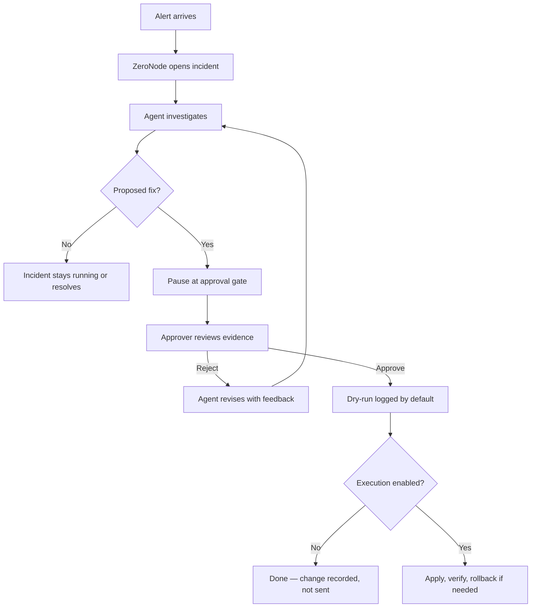

# Using ZeroNode in your work

ZeroNode is a self-hosted assistant for network incidents. It does not replace your judgment — it
does the repetitive investigation work (trace the path, read the firewall, simulate a fix) and
stops at a human gate before anything can change a device.

This guide explains how different people use it day to day. For system internals, see
[how-it-works.md](how-it-works.md). For on-call triage, see [runbooks/on-call.md](runbooks/on-call.md).

---

## Before you start (fresh clone)

ZeroNode is **self-hosted**. Anyone can clone the repo and run it on their own machine, but it is
not “clone and click”. There is no ZeroNode cloud account, license key, or public sign-up — each
install is independent. **All components run on infrastructure you control:** Docker services,
databases, inference (Ollama or vLLM on your network), and device access. Nothing phones home to a
vendor model API.

Do the steps below **before** `docker compose up`, or the stack will not be usable.

### 1. Install prerequisites

| Requirement | Required? | Notes |
| --- | --- | --- |
| **Docker** (with Compose) | Yes | Runs Neo4j, Postgres, API, web, and worker |
| **Git** | Yes | To clone the repository |
| **Inference server** (self-hosted Ollama or vLLM on your network) | For live AI investigations only | Not needed for `python scripts/golden_path.py` |
| Python 3.11+ | For scripts/tests only | Compose runs the app without a local venv |

### Inference (optional — only for live agent runs)

ZeroNode does **not** require Gemma or Ollama. All inference stays **on your network** — there is
no cloud model API. Pick one self-hosted backend in `.env`:

**Option A — Ollama on the host** (default in `.env.example`):

```env
INFERENCE_BACKEND=ollama
OLLAMA_MODEL=gemma4:e4b   # example; use any model your Ollama serves
```

```bash
ollama pull gemma4:e4b    # or any tool-capable model you prefer
ollama serve
```

**Option B — Self-hosted vLLM or TGI** (your own GPU host — no Ollama):

```env
INFERENCE_BACKEND=vllm
VLLM_BASE_URL=http://gpu-host:8000/v1
VLLM_MODEL=your-local-model-id
VLLM_API_KEY=EMPTY
```

The model id is whatever your vLLM instance serves. Install the client with
`pip install -e "apps/api[vllm]"` when using this backend.

### 2. Copy and edit `.env`

```bash
git clone https://github.com/siqah/ZeroNode.git
cd ZeroNode
cp .env.example .env
```

The example file ships with an **empty** `BOOTSTRAP_ADMIN_PASSWORD`. You must fill in secrets
before starting.

**Required** (login will not work without these):

```bash
# Generate a session signing key
JWT_SECRET=$(openssl rand -base64 48)

# First admin — created automatically on startup if no users exist yet
BOOTSTRAP_ADMIN_EMAIL=admin@yourcompany.com
BOOTSTRAP_ADMIN_PASSWORD=at-least-12-characters
```

**Strongly recommended** (approvals cannot be verified after a restart without these):

```bash
# Generate once and paste into .env:
# cd apps/api && python -m app.audit.keys generate
AUDIT_SIGNING_KEY=<paste-generated-key>
AUDIT_ANCHOR_FILE=/var/lib/zeronode/anchors.jsonl
```

**Optional for local experiments:**

```env
MFA_REQUIRED_FOR_APPROVERS=false   # skip authenticator enrolment locally
STRICT_DEPENDENCIES=false          # only if starting API outside Compose before stores are up
SERVICE_TOKEN=<random-token>       # for webhooks and scripts
```

Never commit `.env`. Each person who clones sets **their own** bootstrap password.

### 3. Start the stack

```bash
docker compose up -d --build
curl -fsS http://localhost:8000/health
```

If `/health` returns `503`, check which component is degraded (Postgres, Neo4j, worker, or the
configured inference backend). The API refuses to look healthy while a dependency is down.

After the web image changes (new pages or UI), rebuild the web service:

```bash
docker compose up -d --build web
```

### 4. First sign-in and team setup

1. Open **http://localhost:3000/login**
2. Sign in with `BOOTSTRAP_ADMIN_EMAIL` / `BOOTSTRAP_ADMIN_PASSWORD` from `.env`
3. Open **http://localhost:3000/admin/users** and create operator and approver accounts
4. Send each person their email and initial password **outside ZeroNode** (Slack, 1Password, etc.)

See [Accounts: bootstrap, login, and creating users](#accounts-bootstrap-login-and-creating-users)
below for the full auth flow.

### What works out of the box vs what needs extra config

| Works after the steps above | Needs additional configuration |
| --- | --- |
| Login, dashboard, user management | Real production firewall SSH |
| Seeded lab topology in Neo4j | Your company's inventory / NetBox ingest |
| Mock firewall backend (default in `.env.example`) | Live device execution |
| Dry-run approvals (safe default) | `EXECUTION_ENABLED=true` + named device |
| `python scripts/golden_path.py` (no LLM) | Full live agent path (needs a configured inference backend) |

Default settings are **safe for a fresh clone**: dry-run only, mock firewall, local data only.

### Production is a separate step

Cloning and running locally is not production-ready. Before exposing ZeroNode to a real network,
also configure TLS (`COOKIE_SECURE=true`), `PRODUCTION_BASELINE=true`, managed secrets, backups, and
real device credentials. See [runbooks/deploy.md](runbooks/deploy.md).

---

## What problem it solves

When connectivity breaks across a security zone, an engineer normally:

1. Confirms which path the traffic takes
2. Checks whether it crosses a firewall boundary
3. Reads deny logs and ACL counters on the edge device
4. Proposes a minimal permit rule in the correct line position
5. Gets a second pair of eyes before applying it

ZeroNode automates steps 1–4 with deterministic tools and a local LLM orchestrator. Step 5 stays
with you. By default, even an approved change is **logged only** (dry-run). Live execution is a
separate, explicit opt-in per device.

---

## Who does what

ZeroNode has four roles. You sign in at `/login`; alerting systems use a service token instead.

| Role | Typical job title | What you do in ZeroNode |
| --- | --- | --- |
| **Viewer** | Manager, auditor, trainee | Read incidents, reasoning traces, and the audit ledger. Cannot trigger or approve. |
| **Operator** | NOC engineer, monitoring integration | Receive alerts, open incidents, watch investigations run. Cannot approve changes. |
| **Approver** | Senior network engineer, change approver | Everything an operator can do, plus **Approve** or **Reject** at the gate. Requires MFA. |
| **Admin** | Platform owner, team lead | Manage users, unlock accounts, break glass outside change windows (with a recorded reason). |

**Important:** A monitoring webhook or `SERVICE_TOKEN` can open incidents but can **never**
approve a change. Approvals always require a human with MFA.

---

## Accounts: bootstrap, login, and creating users

ZeroNode has **no public sign-up page**. Every person account is created by an admin (or by the
one-time bootstrap on first deploy).

### Step 1 — First admin (bootstrap, once per install)

Before anyone can log in, set these in `.env` and start the stack:

```env
BOOTSTRAP_ADMIN_EMAIL=admin@yourcompany.com
BOOTSTRAP_ADMIN_PASSWORD=at-least-12-characters
```

On startup, if the `users` table is empty, the API creates that account with the **admin** role.
This happens automatically — you do not register through the UI.

```bash
docker compose up -d --build
open http://localhost:3000/login
```

Sign in with the bootstrap email and password. That person can now create everyone else.

If both bootstrap variables are unset and no users exist, **nobody can log in** and the API logs
an error on startup.

### Step 2 — Admin creates other users

After the bootstrap admin signs in:

1. Open **http://localhost:3000/admin/users** (also linked as **Users** in the top bar when signed
   in as admin)
2. Enter the new person's email, an initial password (12+ characters), and their role
3. Click **Create user**
4. Send the email and password to the person **outside ZeroNode** (Slack, 1Password, in person).
   ZeroNode does not send welcome email or password-reset links.

Alternatively, use the API:

```bash
curl -sS -X POST http://localhost:8000/api/v1/auth/users \
  -H "Content-Type: application/json" \
  -H "Cookie: zn_session=<admin-session>" \
  -H "X-CSRF-Token: <csrf-from-login>" \
  -d '{"email":"noc@example.com","password":"AtLeast12Chars!","role":"operator"}'
```

| Role | Who gets it | Can sign in | Can approve |
| --- | --- | --- | --- |
| `viewer` | Auditor, manager | Yes | No |
| `operator` | NOC engineer | Yes | No |
| `approver` | Senior engineer | Yes | Yes (MFA required by default) |
| `admin` | Platform owner | Yes | Yes + manage users |

### Step 3 — Everyone else signs in

Each person goes to **http://localhost:3000/login** and enters the email and password the admin
gave them.

- **Wrong password five times** → account locks temporarily. An admin unlocks it at `/admin/users`
  or waits for the lockout window (`LOGIN_LOCK_MINUTES` in `.env`).
- **Approvers and admins** → may be prompted to enrol an authenticator (TOTP) before they can
  approve changes. Controlled by `MFA_REQUIRED_FOR_APPROVERS` (default `true`).
- **Sessions** → stored in an httpOnly cookie (`zn_session`). Sign out from the top bar.

There is **no self-service password reset** yet. If someone forgets their password, an admin must
create a new account or you must reset it in Postgres manually.

### What is not a person account

| Credential | Purpose | Signs in at `/login`? |
| --- | --- | --- |
| Bootstrap admin email/password | First human admin | Yes |
| User email/password | NOC, approvers, auditors | Yes |
| `SERVICE_TOKEN` | Alertmanager, scripts, webhooks | No — bearer token on API only |

---

## How an incident flows through your team



### 1. Alert intake (usually automatic)

Incidents arrive from:

- **Prometheus Alertmanager** → `POST /api/v1/webhooks/alertmanager`
- **PagerDuty** → `POST /api/v1/webhooks/pagerduty`
- **Custom monitoring** → `POST /api/v1/webhooks/generic`
- **Manual trigger** → dashboard or `POST /api/v1/incidents/trigger`

Example alert: *"Web_App cannot reach DB_Primary on tcp/443."*

ZeroNode sanitizes the alert text, assigns a stable incident ID, writes it to Postgres, and queues
a background job. You do not need to paste alert text into a chat window.

### 2. Investigation (automatic)

The agent:

- Traces the network path in Neo4j (`Web_App → SW_DMZ → FW_Edge → SW_TRUST → DB_Primary`)
- Confirms the path crosses a security zone boundary
- Reads denied flows and ACL hits from the firewall (read-only `show` commands)
- Proposes a minimal ACL change with a simulated verdict and a rollback command

You can follow this live on the incident page: reasoning trace, topology path, denied flows,
simulation result, and the exact CLI diff it wants to apply.

### 3. Approval gate (your main job as approver)

When the agent is ready, the incident status becomes **awaiting approval**. The dashboard shows:

| What you review | Why it matters |
| --- | --- |
| Traced path and zones | Confirms the agent looked at the right topology |
| Denied flows | Evidence for why traffic is blocked |
| Proposed command + position | The actual change; position matters (a permit after a deny does nothing) |
| Simulation verdict | PASS/FAIL from the policy simulator — not the model's opinion |
| Rollback command | What would undo the change |
| Alert flags | Anything suspicious in the original alert text (injection, "skip approval", etc.) |

**Approve** if the evidence supports the change and the change window is open.

**Reject** with feedback if the proposal is wrong — the agent gets your note and tries again.

Approvers need TOTP (authenticator app). Enrol on first login if prompted.

### 4. After approval (usually automatic)

- **Default (dry-run):** The approved change is written to the signed audit ledger and logged. Nothing is sent to the device.
- **Execution enabled:** The change is applied to a named device, read back for verification, and automatically rolled back if verification fails.

Every approval is sealed in an Ed25519-signed, hash-chained ledger before the agent resumes.

---

## A typical day by role

### NOC operator

**Morning:** Check `/health` and the dashboard for stuck incidents.

**When an alert fires:**

1. Confirm the incident appeared (from webhook or manual trigger)
2. Open `/incidents/{thread_id}` and watch the investigation
3. If it reaches **awaiting approval**, ping the on-call approver
4. Do not SSH to the firewall to "help" — that bypasses the audit trail

**You use:** dashboard, incident list, incident status polling.

**You do not:** approve changes, edit device config directly for incidents ZeroNode owns.

### Senior engineer / approver

**When paged for approval:**

1. Open the incident link from Slack/Teams/PagerDuty notification (if configured)
2. Read the path, deny evidence, simulation verdict, and CLI diff
3. Check alert flags and change window status
4. Approve or reject with a short note

**Outside a change window:** Only an admin can override, and must provide a break-glass reason that is recorded in the ledger.

**After approving:** Optionally verify the ledger:

```bash
curl -sS -H "Authorization: Bearer $TOKEN" http://localhost:8000/api/v1/audit/verify | jq .
```

### Platform admin

**Setup (once):**

- Copy `.env.example` → `.env`, set secrets, bootstrap admin, audit key, anchor path
- Start stack: `docker compose up -d --build` or `./scripts/deploy.sh up`
- Point Alertmanager/PagerDuty at webhook URLs
- Optionally configure ticket and notification webhooks

**Ongoing:**

- Create users and assign roles
- Rotate `JWT_SECRET`, `AUDIT_SIGNING_KEY`, webhook secrets
- Run backups: `scripts/backup_datastores.sh`
- Monitor `/health` degradations (worker down, stale topology, queue saturated)

See [runbooks/deploy.md](runbooks/deploy.md) and [runbooks/on-call.md](runbooks/on-call.md).

### Auditor / compliance

**Read-only access** with the `viewer` role:

- `GET /api/v1/audit/approvals` — full approval history
- `GET /api/v1/audit/verify` — chain integrity and external anchor status
- Incident pages — what the approver saw at decision time (evidence is sealed in the ledger)

The ledger answers: *who approved what, when, with what evidence, and whether the record chain is intact.*

---

## Where you work in the UI

| URL | Purpose |
| --- | --- |
| `/login` | Sign in; enrol MFA for approvers |
| `/dashboard` | Incident list and overview |
| `/admin/users` | Create users, unlock accounts (admin only) |
| `/incidents/{thread_id}` | Live investigation, approval gate, execution outcome |

On the incident page you will see:

- **Reasoning trace** — step-by-step agent decisions
- **Path visualizer** — topology path across devices and zones
- **Approval gate** — proposed change, simulation, Approve/Reject buttons
- **Execution outcome** — dry-run log or live apply/rollback result

---

## How alerts connect to your existing tools

ZeroNode fits into a normal NOC stack without replacing it:

| Your tool | How ZeroNode uses it |
| --- | --- |
| **Alertmanager / PagerDuty** | Inbound webhooks open incidents automatically |
| **ServiceNow / Jira** | Outbound ticket webhook records incident, decision, and outcome |
| **Slack / Teams / Mattermost** | Notification webhook pings approvers when a change waits at the gate |
| **NetBox** | Topology ingest keeps Neo4j aligned with inventory (optional) |
| **Inference backend** | Self-hosted Ollama or vLLM on your network — alert and topology data never leave your perimeter |

Nothing leaves your perimeter unless you configure those outbound webhooks.

---

## What ZeroNode will not do for you

- **Replace change management.** It enforces windows and freezes; it does not write your CAB ticket.
- **Approve itself.** Machines can trigger; only humans with MFA can approve.
- **Silently fail.** If Postgres, Neo4j, the worker, or inference is degraded, `/health` returns 503.
- **Apply changes by default.** Dry-run is the default. Live execution requires `EXECUTION_ENABLED` and the device named in `EXECUTION_DEVICES`.
- **Trust alert text blindly.** Alerts are sanitized and flagged; the agent still reads policy from the device, not from the alert.

---

## Quick start for a new user

If you have already completed [Before you start (fresh clone)](#before-you-start-fresh-clone):

```bash
# 1. Start the stack and bootstrap the first admin
cp .env.example .env   # set BOOTSTRAP_ADMIN_EMAIL/PASSWORD and other secrets
docker compose up -d --build

# 2. Sign in as bootstrap admin
open http://localhost:3000/login

# 3. Create NOC and approver accounts
open http://localhost:3000/admin/users

# 4. Trigger a test incident (as operator)
ZERONODE_PASSWORD='your-bootstrap-password' ./scripts/trigger_golden_alert.sh

# 5. Review and approve (as approver)
open http://localhost:3000/incidents/INC-1001
```

For a scripted walkthrough without waiting on the live model:

```bash
python scripts/golden_path.py
```

---

## Related docs

- [how-it-works.md](how-it-works.md) — technical walkthrough
- [architecture.md](architecture.md) — product thesis and design pillars
- [runbooks/deploy.md](runbooks/deploy.md) — production deployment
- [runbooks/on-call.md](runbooks/on-call.md) — incident response when ZeroNode itself is unhealthy
- [roadmap.md](roadmap.md) — what is not built yet (e.g. production hardware validation)
